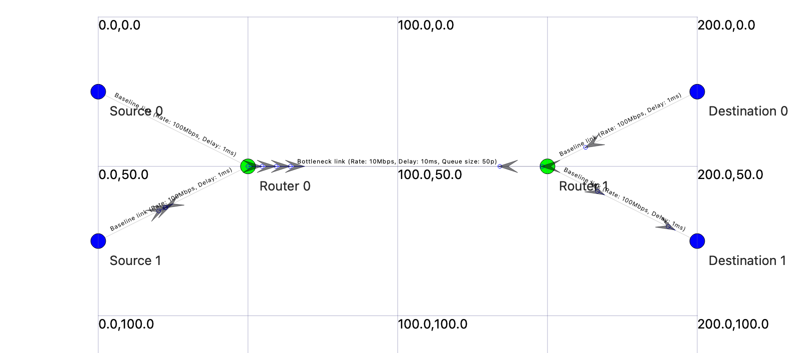
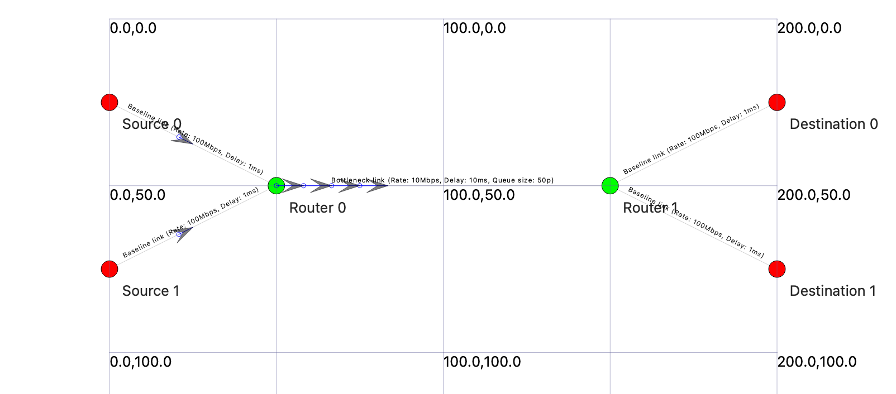
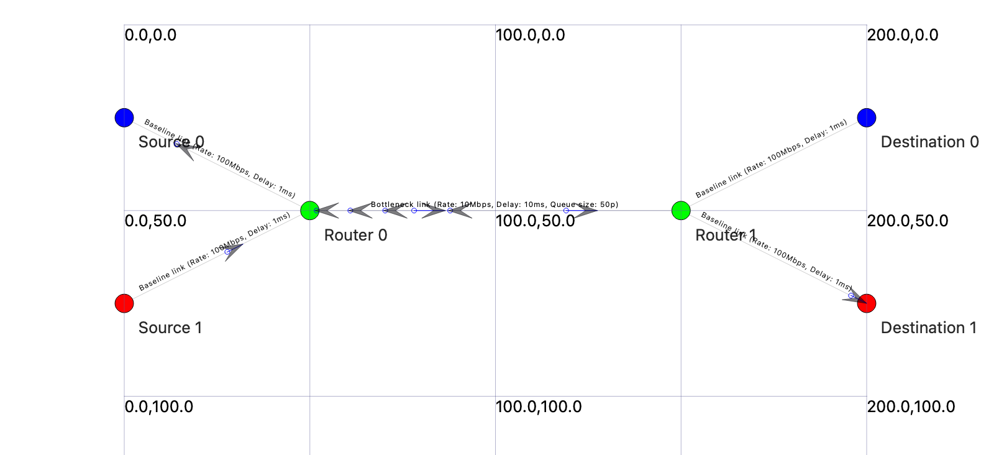
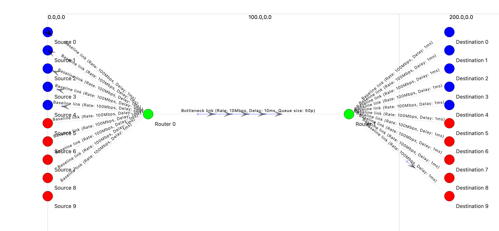

# Simulations

## buffer-simulation

This simulation has the objective of analyzing how the buffer size affects data flow. Metrics such as throughput, latency, and packet loss are collected to understand the impact of different buffer sizes on network performance. See results and line charts in https://docs.google.com/spreadsheets/d/e/2PACX-1vT0bVNkllmD_IhFfsIunuudCD6aoQU-WdAWtDOV2CYuQgbxYoIm0zfzc7FAntmd4YDP94ovQChUXKoh/pubhtml.

The primary parameter of this simulation is the router buffer size, which is set to 2, 10, 50 (baseline), 100, and 500.

Performance is analyzed across three traffic modes - TCP, UDP, and mixed.

The topology is a standard dumbbell topology with 2 sources and 2 destinations separated by 2 routers. The sources and destinations are connected to the routers with 100 Mbps links and 1ms delay, while the routers are connected to each other with a 10 Mbps link and 10ms delay.

In the TCP mode, sources send as much data as possible with no maximum byte limit.

In the UDP mode, sources send at a constant rate of 10 Mbps and packet size of 1 KB.

The mixed mode represents a typical real world traffic distribution by allocating 80% of the bandwidth to TCP and 20% to UDP. In this setup, one source sends TCP packets at a fixed rate of 8 Mbps and the other sends UDP packets at 2 Mbps, and both flows use a standard packet size of 1 KB.

In the following topology, blue nodes represent TCP sources and destinations, red nodes represent UDP sources and destinations, and green nodes represent routers.

**TCP mode topology**

**UDP mode topology**

**Mixed mode topology**

## class-imbalance-simulation

This simulation demonstrates protocol fairness and UDP starvation in a dumbbell topology. The objective is to analyze how TCP and UDP flows compete for bandwidth. Metrics such as throughput, latency, and packet loss are collected to understand the impact of protocol distribution on network performance. See results and line charts in https://docs.google.com/spreadsheets/d/e/2PACX-1vQCXbfnjDvc32tZkmyNE39POfm0AMOsht9wSjESLmo_ZB2PHFEl9ZhRm6wgNQlUNGGVY5VvGFRB_JVK/pubhtml.

The primary parameter of this simulation is the TCP to UDP flow ratio, tested at five specific points: 9:1, 7:3, 5:5 (baseline), 3:7, and 1:9.

The topology is a dumbbell topology with N sources and N destinations (where N = total flows), separated by 2 routers. Each source and destination is connected to their respective routers with a 100 Mbps link and 1ms delay. The routers are connected to each other with a 10 Mbps link, 10ms delay, and a 50-packet buffer.

Each TCP source sends as much data as possible with no maximum byte limit.

Each UDP source sends at a constant rate of 1.1 Mbps and packet size of 1 KB. This rate is chosen to be slightly above the fair share of bandwidth for each flow (which is 1 Mbps for 10 total flows) to demonstrate the effects of protocol competition.

In the following topology, blue nodes represent TCP sources and destinations, red nodes represent UDP sources and destinations, and green nodes represent routers.

